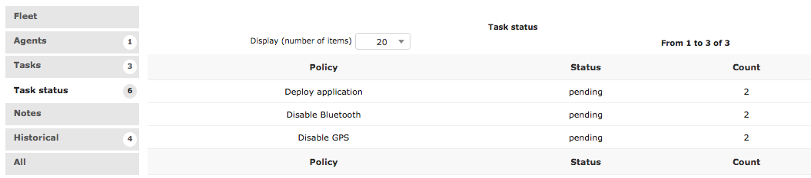
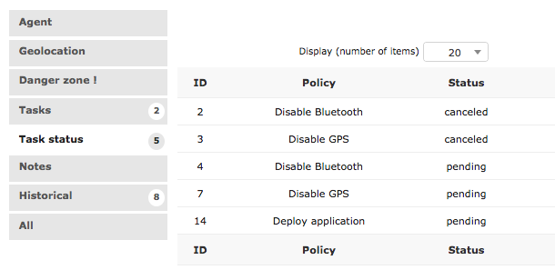

Create your Fleet
-----------------

You must create a new fleet since the "not managed fleet" is the default one and therefore comes locked.

.. warning::
   Carefull, be sure to not delete it since it will bring you some problems.

In order to create it, you only have to follow these steps:

* Click in the "+" button on the Fleet section
* Name it and Click on add.

.. image:: images/fleet.gif
   :alt: Fleet creation

When you return to the Fleet section, you'll see your created fleet listed.

Add Policies
~~~~~~~~~~~~

To add the policies:

* Go to the Fleets section 
* Select your Fleet by clicking on it
* Select the Policies tab

There you can add all the policies your fleet requires.

.. image:: images/add-policy.png
   :alt: Fleet creation

Once you assign the devices to the Fleet, all the policies will be immediately applied!

Task Status
~~~~~~~~~~~

You can check the status of the policies deployed.

============  =========================================================
Status        Description
------------  ---------------------------------------------------------
Pending       Waiting for publication of the task, not yet received by the Agent
Received      Succesfully received by the Agent, not yet applied
Done          Task succesfully applied
Failed        Task could not be applied due to a failure
Canceled      The task was canceled
Incompatible  The task cannot be applied on the device because it is incompatible
Overriden     The task is overiden by a similar one applied on the device itself
Waiting       Only for deploy tasks which require time for application
============  =========================================================

From the Fleets section

Select your fleet then click on the Task Status tab

From the Agent section.

Select the Agent then click on the Task Status tab

Assign the Agent to a Fleet
~~~~~~~~~~~~~~~~~~~~~~~~~~~

For this you must go to the Agent section

* Select the Agent
* In the Fleet option, select your fleet
* Click on save

.. image:: images/assign-fleet.png
   :alt: Assign a fleet

.. note::
   An Agent can be assigned to only one Fleet.

Adding Files & Applications
---------------------------

You must add in their respective sections the Files and Packages so you can deploy them on your Fleet. 

.. note::
   You must have previously added the APK and UPK types.

* Go to the Files section
* Click on the "+" button
* Name and select your file
* Click on Add

.. image:: images/file.gif
    :alt: Adding files

Now it will be available when you use the Deploy file policy.

.. image:: images/file-added.png
    :alt: File deployment

The same procedure applies to the applications.

* Go to the Package section
* Click on the "+" button
* Name and select your application
* Click on Add

.. image:: images/app.gif
    :alt: Adding Applications

Now it will be available when you use the Deploy application policy.

.. image:: images/app-added.png 
    :alt: Apps deployment